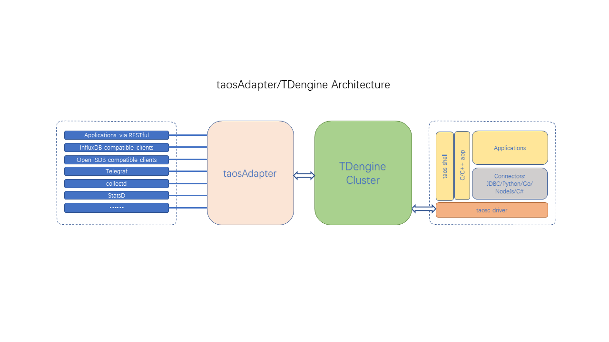

# taosAdapter

[中文版](https://github.com/taosdata/taosadapter/blob/develop/README-CN.md)

taosAdapter is a TDengine’s companion tool and is a bridge/adapter between TDengine cluster and application. It provides an easy-to-use and efficient way to ingest data from data collections agents(like Telegraf, StatsD, collectd) directly. It also provides InfluxDB/OpenTSDB compatible data ingestion interface to allow InfluxDB/OpenTSDB applications to immigrate to TDengine seamlessly.

taosAdapter provides the following functions.

- RESTful interface
- Compatible with InfluxDB v1 write interface
- Compatible with OpenTSDB JSON and telnet format write
- Seamless connect to Telegraf
- Seamless connect to collectD
- Seamless connect to StatsD
- Support Prometheus remote_read and remote_write

## taosAdapter architecture



## taosAdapter deployment

### Install taosAdapter

taosAdapter is part of the TDengine server from TDengine v2.4.0.0. You don't need any additional steps to install taosAdapter if you already installed TDengine server. You can download TDengine server package (taosAdapter be included in v2.4.0.0 and above version) from the [official website](https://taosdata.com/en/all-downloads/). If you want to deploy taosAdapter on another server, you need to install official TDengine server installation package. If you want to build taosAdapter from source code, you can refer to the [How to build taosAdapter](https://github.com/taosdata/taosadapter/blob/develop/BUILD.md) instruction.

### Start/Stop taosAdapter

taosAdapter service is managed by the systemd by default on the Linux system. It can be started by the command `systemctl start taosadapter` and be stopped by the command `systemctl stop taosadapter`.

### Uninstall taosAdapter

The command `rmtaos` will remove the TDengine server software including taosAdapter too.

### Upgrade taosAdapter

taosAdapter only properly run with the same version of TDengine server.
You need to upgrade TDengine server to upgrade taosAdapter.
A separate deployed taosAdapter need to upgrade the corresponding version of TDengine server package too.

## taosAdapter's parameters

taosAdapter supports command line parameters, environment variables, and configuration files.
The default configuration file is `/etc/taos/taosadapter.toml`.

`Command-line parameters take precedence over environment variables take precedence over configuration files`

The command line usage is arg=val such as `taosadapter -p=30000 --debug=true`

```shell
Usage of taosAdapter:
      --collectd.db string                           collectd db name. Env "TAOS_ADAPTER_COLLECTD_DB" (default "collectd")
      --collectd.enable                              enable collectd. Env "TAOS_ADAPTER_COLLECTD_ENABLE" (default true)
      --collectd.password string                     collectd password. Env "TAOS_ADAPTER_COLLECTD_PASSWORD" (default "taosdata")
      --collectd.port int                            collectd server port. Env "TAOS_ADAPTER_COLLECTD_PORT" (default 6045)
      --collectd.user string                         collectd user. Env "TAOS_ADAPTER_COLLECTD_USER" (default "root")
      --collectd.worker int                          collectd write worker. Env "TAOS_ADAPTER_COLLECTD_WORKER" (default 10)
  -c, --config string                                config path default /etc/taos/taosadapter.toml
      --cors.allowAllOrigins                         cors allow all origins. Env "TAOS_ADAPTER_CORS_ALLOW_ALL_ORIGINS" (default true)
      --cors.allowCredentials                        cors allow credentials. Env "TAOS_ADAPTER_CORS_ALLOW_Credentials"
      --cors.allowHeaders stringArray                cors allow HEADERS. Env "TAOS_ADAPTER_ALLOW_HEADERS"
      --cors.allowOrigins stringArray                cors allow origins. Env "TAOS_ADAPTER_ALLOW_ORIGINS"
      --cors.allowWebSockets                         cors allow WebSockets. Env "TAOS_ADAPTER_CORS_ALLOW_WebSockets"
      --cors.exposeHeaders stringArray               cors expose headers. Env "TAOS_ADAPTER_Expose_Headers"
      --debug                                        enable debug mode. Env "TAOS_ADAPTER_DEBUG"
      --help                                         Print this help message and exit
      --influxdb.enable                              enable influxdb. Env "TAOS_ADAPTER_INFLUXDB_ENABLE" (default true)
      --log.path string                              log path. Env "TAOS_ADAPTER_LOG_PATH" (default "/var/log/taos")
      --log.rotationCount uint                       log rotation count. Env "TAOS_ADAPTER_LOG_ROTATION_COUNT" (default 30)
      --log.rotationSize string                      log rotation size(KB MB GB), must be a positive integer. Env "TAOS_ADAPTER_LOG_ROTATION_SIZE" (default "1GB")
      --log.rotationTime duration                    log rotation time. Env "TAOS_ADAPTER_LOG_ROTATION_TIME" (default 24h0m0s)
      --logLevel string                              log level (panic fatal error warn warning info debug trace). Env "TAOS_ADAPTER_LOG_LEVEL" (default "info")
      --monitor.collectDuration duration             Set monitor duration. Env "TAOS_MONITOR_COLLECT_DURATION" (default 3s)
      --monitor.identity string                      The identity of the current instance, or 'hostname:port' if it is empty. Env "TAOS_MONITOR_IDENTITY"
      --monitor.incgroup                             Whether running in cgroup. Env "TAOS_MONITOR_INCGROUP"
      --monitor.password string                      TDengine password. Env "TAOS_MONITOR_PASSWORD" (default "taosdata")      
      --monitor.pauseAllMemoryThreshold float        Memory percentage threshold for pause all. Env "TAOS_MONITOR_PAUSE_ALL_MEMORY_THRESHOLD" (default 80)
      --monitor.pauseQueryMemoryThreshold float      Memory percentage threshold for pause query. Env "TAOS_MONITOR_PAUSE_QUERY_MEMORY_THRESHOLD" (default 70)
      --monitor.user string                          TDengine user. Env "TAOS_MONITOR_USER" (default "root")
      --monitor.writeInterval duration               Set write to TDengine interval. Env "TAOS_MONITOR_WRITE_INTERVAL" (default 30s)
      --monitor.writeToTD                            Whether write metrics to TDengine. Env "TAOS_MONITOR_WRITE_TO_TD" (default true)
      --node_exporter.caCertFile string              node_exporter ca cert file path. Env "TAOS_ADAPTER_NODE_EXPORTER_CA_CERT_FILE"
      --node_exporter.certFile string                node_exporter cert file path. Env "TAOS_ADAPTER_NODE_EXPORTER_CERT_FILE"
      --node_exporter.db string                      node_exporter db name. Env "TAOS_ADAPTER_NODE_EXPORTER_DB" (default "node_exporter")
      --node_exporter.enable                         enable node_exporter. Env "TAOS_ADAPTER_NODE_EXPORTER_ENABLE"
      --node_exporter.gatherDuration duration        node_exporter gather duration. Env "TAOS_ADAPTER_NODE_EXPORTER_GATHER_DURATION" (default 5s)
      --node_exporter.httpBearerTokenString string   node_exporter http bearer token. Env "TAOS_ADAPTER_NODE_EXPORTER_HTTP_BEARER_TOKEN_STRING"
      --node_exporter.httpPassword string            node_exporter http password. Env "TAOS_ADAPTER_NODE_EXPORTER_HTTP_PASSWORD"
      --node_exporter.httpUsername string            node_exporter http username. Env "TAOS_ADAPTER_NODE_EXPORTER_HTTP_USERNAME"
      --node_exporter.insecureSkipVerify             node_exporter skip ssl check. Env "TAOS_ADAPTER_NODE_EXPORTER_INSECURE_SKIP_VERIFY" (default true)
      --node_exporter.keyFile string                 node_exporter cert key file path. Env "TAOS_ADAPTER_NODE_EXPORTER_KEY_FILE"
      --node_exporter.password string                node_exporter password. Env "TAOS_ADAPTER_NODE_EXPORTER_PASSWORD" (default "taosdata")
      --node_exporter.responseTimeout duration       node_exporter response timeout. Env "TAOS_ADAPTER_NODE_EXPORTER_RESPONSE_TIMEOUT" (default 5s)
      --node_exporter.urls strings                   node_exporter urls. Env "TAOS_ADAPTER_NODE_EXPORTER_URLS" (default [http://localhost:9100])
      --node_exporter.user string                    node_exporter user. Env "TAOS_ADAPTER_NODE_EXPORTER_USER" (default "root")
      --opentsdb.enable                              enable opentsdb. Env "TAOS_ADAPTER_OPENTSDB_ENABLE" (default true)
      --opentsdb_telnet.dbs strings                  opentsdb_telnet db names. Env "TAOS_ADAPTER_OPENTSDB_TELNET_DBS" (default [opentsdb_telnet,collectd_tsdb,icinga2_tsdb,tcollector_tsdb])
      --opentsdb_telnet.enable                       enable opentsdb telnet,warning: without auth info(default false). Env "TAOS_ADAPTER_OPENTSDB_TELNET_ENABLE"
      --opentsdb_telnet.maxTCPConnections int        max tcp connections. Env "TAOS_ADAPTER_OPENTSDB_TELNET_MAX_TCP_CONNECTIONS" (default 250)
      --opentsdb_telnet.password string              opentsdb_telnet password. Env "TAOS_ADAPTER_OPENTSDB_TELNET_PASSWORD" (default "taosdata")
      --opentsdb_telnet.ports ints                   opentsdb telnet tcp port. Env "TAOS_ADAPTER_OPENTSDB_TELNET_PORTS" (default [6046,6047,6048,6049])
      --opentsdb_telnet.tcpKeepAlive                 enable tcp keep alive. Env "TAOS_ADAPTER_OPENTSDB_TELNET_TCP_KEEP_ALIVE"
      --opentsdb_telnet.user string                  opentsdb_telnet user. Env "TAOS_ADAPTER_OPENTSDB_TELNET_USER" (default "root")
      --pool.idleTimeout duration                    Set idle connection timeout. Env "TAOS_ADAPTER_POOL_IDLE_TIMEOUT" (default 1h0m0s)
      --pool.maxConnect int                          max connections to taosd. Env "TAOS_ADAPTER_POOL_MAX_CONNECT" (default 4000)
      --pool.maxIdle int                             max idle connections to taosd. Env "TAOS_ADAPTER_POOL_MAX_IDLE" (default 4000)
  -P, --port int                                     http port. Env "TAOS_ADAPTER_PORT" (default 6041)
      --prometheus.enable                            enable prometheus. Env "TAOS_ADAPTER_PROMETHEUS_ENABLE" (default true)
      --restfulRowLimit int                          restful returns the maximum number of rows (-1 means no limit). Env "TAOS_ADAPTER_RESTFUL_ROW_LIMIT" (default -1)
      --ssl.certFile string                          ssl cert file path. Env "TAOS_ADAPTER_SSL_CERT_FILE"
      --ssl.enable                                   enable ssl. Env "TAOS_ADAPTER_SSL_ENABLE"
      --ssl.keyFile string                           ssl key file path. Env "TAOS_ADAPTER_SSL_KEY_FILE"
      --statsd.allowPendingMessages int              statsd allow pending messages. Env "TAOS_ADAPTER_STATSD_ALLOW_PENDING_MESSAGES" (default 50000)
      --statsd.db string                             statsd db name. Env "TAOS_ADAPTER_STATSD_DB" (default "statsd")
      --statsd.deleteCounters                        statsd delete counter cache after gather. Env "TAOS_ADAPTER_STATSD_DELETE_COUNTERS" (default true)
      --statsd.deleteGauges                          statsd delete gauge cache after gather. Env "TAOS_ADAPTER_STATSD_DELETE_GAUGES" (default true)
      --statsd.deleteSets                            statsd delete set cache after gather. Env "TAOS_ADAPTER_STATSD_DELETE_SETS" (default true)
      --statsd.deleteTimings                         statsd delete timing cache after gather. Env "TAOS_ADAPTER_STATSD_DELETE_TIMINGS" (default true)
      --statsd.enable                                enable statsd. Env "TAOS_ADAPTER_STATSD_ENABLE" (default true)
      --statsd.gatherInterval duration               statsd gather interval. Env "TAOS_ADAPTER_STATSD_GATHER_INTERVAL" (default 5s)
      --statsd.maxTCPConnections int                 statsd max tcp connections. Env "TAOS_ADAPTER_STATSD_MAX_TCP_CONNECTIONS" (default 250)
      --statsd.password string                       statsd password. Env "TAOS_ADAPTER_STATSD_PASSWORD" (default "taosdata")
      --statsd.port int                              statsd server port. Env "TAOS_ADAPTER_STATSD_PORT" (default 6044)
      --statsd.protocol string                       statsd protocol [tcp or udp]. Env "TAOS_ADAPTER_STATSD_PROTOCOL" (default "udp")
      --statsd.tcpKeepAlive                          enable tcp keep alive. Env "TAOS_ADAPTER_STATSD_TCP_KEEP_ALIVE"
      --statsd.user string                           statsd user. Env "TAOS_ADAPTER_STATSD_USER" (default "root")
      --statsd.worker int                            statsd write worker. Env "TAOS_ADAPTER_STATSD_WORKER" (default 10)
      --taosConfigDir string                         load taos client config path. Env "TAOS_ADAPTER_TAOS_CONFIG_FILE"
      --version                                      Print the version and exit
```

Note:
If you support users using the web browser to access the interfaces, please configure the following CORS parameters according to your practical network setting:

```text
AllowAllOrigins
AllowOrigins
AllowHeaders
ExposeHeaders
AllowCredentials
AllowWebSockets
```

If not, you don't need to configure them.

Please visit the webpage [https://www.w3.org/wiki/CORS_Enabled](https://www.w3.org/wiki/CORS_Enabled) or [https://developer.mozilla.org/zh-CN/docs/Web/HTTP/CORS](https://developer.mozilla.org/zh-CN/docs/Web/HTTP/CORS) for the detailed CORS protocol.

For the default configuration file, see [example/config/taosadapter.toml](https://github.com/taosdata/taosadapter/blob/develop/example/config/taosadapter.toml)

## Functions

* Compatible with RESTful interface.
  [https://www.taosdata.com/cn/documentation/connector#restful](https://www.taosdata.com/cn/documentation/connector#restful)
* Compatible with InfluxDB v1 write interface.
  [https://docs.influxdata.com/influxdb/v2.0/reference/api/influxdb-1x/write/](https://docs.influxdata.com/influxdb/v2.0/reference/api/influxdb-1x/write/)
* Compatible with opentsdb JSON and telnet format writing.
  * <http://opentsdb.net/docs/build/html/api_http/put.html>
  * <http://opentsdb.net/docs/build/html/api_telnet/put.html>
* Seamless connection with collectd.
    collectd is a system statistics collection daemon. Please visit [https://collectd.org/](https://collectd.org/)for detail.
* Seamless connection with StatsD.
    StatsD is a daemon for easy but powerful stats aggregation. Please visit [https://github.com/statsd/statsd](https://github.com/statsd/statsd) for detail.
* Seamless connection with icinga2.
    icinga2 is an agent to collect check result metrics and performance data. Please visit [https://icinga.com/docs/icinga-2/latest/doc/14-features/#opentsdb-writer](https://icinga.com/docs/icinga-2/latest/doc/14-features/#opentsdb-writer) for detail.
* Seamless connection with tcollector.
    TCollector is a client-side process that gathers data from local collectors and pushes the data to OpenTSDB. Please visit [http://opentsdb.net/docs/build/html/user_guide/utilities/tcollector.html](http://opentsdb.net/docs/build/html/user_guide/utilities/tcollector.html) for detail.
* Seamless connection with node_exporter.
    NodeExporter is an exporter software for machine metrics. Please visit [https://github.com/prometheus/node_exporter](https://github.com/prometheus/node_exporter) for detail.
* Support Prometheus remote_read and remote_write
  remote_read and remote_write are Prometheus data read-write separation cluster solutions. Please visit [https://prometheus.io/blog/2019/10/10/remote-read-meets-streaming/#remote-apis](https://prometheus.io/blog/2019/10/10/remote-read-meets-streaming/#remote-apis) for detail.

## Interface

### TDengine RESTful interface

You can use any http client to access the RESTful interface address `http://<fqdn>:6041/<APIEndPoint>` to insert to or query from TDengine. Please refer to the [official documentation](https://www.taosdata.com/cn/documentation/connector#restful) for detail. The end point could be following:

```text
/rest/sql
/rest/sqlt
/rest/sqlutc
```

### InfluxDB

You can use any http client to access the RESTful interface address `http://<fqdn>:6041/<APIEndPoint>` to insert InfluxDB compatible protocol data to TDengine. The end point is:

```text
/influxdb/v1/write
```

Support following InfluxDB query parameters:

* `db` Specify the necessary parameters for the database
* `precision` time precision non-essential parameter
* `u` user non-essential parameters
* `p` password Optional parameter

Note: There is currently not supported token authentication in InfluxDB only supports Basic authentication and query parameter authentication.

### OpenTSDB

You can use any http client to access the RESTful interface address `http://<fqdn>:6041/<APIEndPoint>` to insert OpenTSDB compatible protocol data to TDengine. The end point is:

```text
/opentsdb/v1/put/json/<db>
/opentsdb/v1/put/telnet/<db>
```

### collectd

#### direct collection

Modify the collectd configuration `/etc/collectd/collectd.conf`. taosAdapter uses 6045 for collectd direct collection data write by default.

```text
LoadPlugin network
<Plugin network>
         Server "127.0.0.1" "6045"
</Plugin>
```

#### tsdb writer

Modify the collectd configuration `/etc/collectd/collectd.conf`. taosAdapter uses 6047 for collectd tsdb write by default.

```text
LoadPlugin write_tsdb
<Plugin write_tsdb>
        <Node>
                Host "localhost"
                Port "6047"
                HostTags "status=production"
                StoreRates false
                AlwaysAppendDS false
        </Node>
</Plugin>
```

### StatsD

modify the configuration file `path_to_statsd/config.js`

*  `backends` add `"./backends/repeater"`
*  `repeater` add `{ host:'host to taosAdapter', port: 6044}`

An example configuration file as below:

```js
{
  port: 8125,
  backends: ["./backends/repeater"],
  repeater: [{ host: '127.0.0.1', port: 6044}]
}
```

### icinga2 OpenTSDB writer

Use icinga2 to collect check result metrics and performance data

* Follow the doc to enable
  opentsdb-writer [https://icinga.com/docs/icinga-2/latest/doc/14-features/#opentsdb-writer](https://icinga.com/docs/icinga-2/latest/doc/14-features/#opentsdb-writer)
* Enable taosAdapter configuration `opentsdb_telnet.enable`
* Modify the configuration file `/etc/icinga2/features-enabled/opentsdb.conf`

```text
object OpenTsdbWriter "opentsdb" {
  host = "host to taosAdapter"
  port = 6048
}
```

### TCollector

TCollector is a client-side process that gathers data from local collectors and pushes the data to OpenTSDB. You run it on all your hosts, and it does the work of sending each host’s data to the TSD (OpenTSDB backend process).

* Enable taosAdapter configuration `opentsdb_telnet.enable`
* Modify the TCollector configuration file, modify the OpenTSDB host to the host where taosAdapter is deployed, and modify the port to 6049

### node_exporter

Prometheus exporter for hardware and OS metrics exposed by *NIX kernels

* Enable taosAdapter configuration `node_exporter.enable`
* Set the relevant configuration of node_exporter
* Restart taosAdapter

### prometheus

Remote_read and remote_write are cluster schemes for Prometheus data read-write separation.
Just use the REMOTE_READ and REMOTE_WRITE URL to point to the URL corresponding to Taosadapter to use Basic authentication.

* Remote_read url: `http://host_to_taosadapter:port (default 6041) /prometheus/v1/remote_read/:db`
* Remote_write url: `http://host_to_taosadapter:port (default 6041) /Prometheus/v1/remote_write/:db`

Basic verification:

* Username: TDengine connection username
* Password: TDengine connection password

Example Prometheus.yml is as follows:

```yaml
remote_write:
  - url: "http://localhost:6041/prometheus/v1/remote_write/prometheus_data"
    basic_auth:
      username: root
      password: taosdata

remote_read:
  - url: "http://localhost:6041/prometheus/v1/remote_read/prometheus_data"
    basic_auth:
      username: root
      password: taosdata
    remote_timeout: 10s
    read_recent: true
```

## Memory usage optimization

taosAdapter will monitor itself memory usage during its running. You can adjust its thresholds via two parameters.
The valid value is from -1 to 100. The unit is the percentage of physical memory on the system.

* pauseQueryMemoryThreshold
* pauseAllMemoryThreshold

Query requests will be rejected when the pauseQueryMemoryThreshold is exceeded.

http return

* code 503
* body "query memory exceeds threshold"

All write and query requests will be rejected when the pauseAllMemoryThreshold is exceeded.

http return

* code 503
* body "memory exceeds threshold"

The corresponding function will resume when the memory usage falls back below the threshold.

Status check interface `http://<fqdn>:6041/-/ping`

* Normal return ``code 200``
* No parameter Returns `code 503` if memory exceeds pauseAllMemoryThreshold
* request parameter `action=query` returns `code 503` if memory exceeds pauseQueryMemoryThreshold or pauseAllMemoryThreshold

for the corresponding configuration parameter

```text
monitor.collectDuration duration             Set monitor duration. Env "TAOS_MONITOR_COLLECT_DURATION" (default 3s)
monitor.incgroup                             Whether running in cgroup. Env "TAOS_MONITOR_INCGROUP"
monitor.pauseAllMemoryThreshold float        Memory percentage threshold for pause query and insert. Env "TAOS_MONITOR_PAUSE_ALL_MEMORY_THRESHOLD" (default 80)
monitor.pauseQueryMemoryThreshold float      Memory percentage threshold for pause query. Env "TAOS_MONITOR_PAUSE_QUERY_MEMORY_THRESHOLD" (default 70)
```

You can adjust them according to the specific project scenarios and operation strategies, and it is recommended to use operation monitoring software to monitor system memory status in a timely manner too. You can configure the load balancer to check the interface for checking taosAdapter's running status too.

## taosAdapter monitoring metrics

taosAdapter collects http related metrics, cpu percentage and memory percentage.

### http interface

Provides an [OpenMetrics](https://github.com/OpenObservability/OpenMetrics/blob/main/specification/OpenMetrics.md) interface.

```text
http://<fqdn>:6041/metrics
```

### Write to TDengine

taosAdapter supports writing metrics to TDengine.

Related configuration parameters

| **configuration**       | **description**                                                                      | **default values** |
| ----------------------- | ------------------------------------------------------------------------------------ | ------------------ |
| monitor.collectDuration | cpu and memory collection interval                                                   | 3s                 |
| monitor.identity        | The identifier of the current taosadapter will be used if not set to 'hostname:port' |                    |
| monitor.incgroup        | whether running in a cgroup (set to true when running in a container)                | false              |
| monitor.writeToTD       | Whether to write to TDengine                                                         | true               |
| monitor.user            | TDengine connection username                                                         | root               |
| monitor.password        | TDengine connection password                                                         | taosdata           |
| monitor.writeInterval   | write to TDengine interval                                                           | 30s                |

## Limit on the rows of returned result

taosAdapter controls the rows of result returned by the parameter `restfulRowLimit`, -1 means no limit, default is no limit.

This parameter controls the following interface returns

* `http://<fqdn>:6041/rest/sql`
* `http://<fqdn>:6041/rest/sqlt`
* `http://<fqdn>:6041/rest/sqlutc`
* `http://<fqdn>:6041/prometheus/v1/remote_read/:db`

## Troubleshooting

You can use `systemctl status taosadapter` to check the running status of the taosAdapter.

Or you can set `--logLevel` or the environment variable "TAOS_ADAPTER_LOG_LEVEL" to adjust the detail level how many log taosAdapter output. The valid values include panic, fatal, error, warn, warning, info, debug, and trace.

## How to migrate to taosAdapter from old version of TDengine server

In the early version (2.2.x.x or earlier version), TDengine server provided an embedded http service by default. It will compulsorily running with the `taosd` process. As mentioned early, taosAdapter need be manually run by 'systemctl start taosadapter' and has its own process. Some parameters and behaviors are different between the embedded httpd and taosAdapter. Please see below:

| **#** | **embedded httpd**  | **taosAdapter**                                    | **comment**                                                                                                                                                                   |
| ----- | ------------------- | -------------------------------------------------- | ----------------------------------------------------------------------------------------------------------------------------------------------------------------------------- |
| 1     | httpEnableRecordSql | --logLevel=debug                                   |                                                                                                                                                                               |
| 2     | httpMaxThreads      | n/a                                                | taosAdapter no need this parameter                                                                                                                                             |
| 3     | telegrafUseFieldNum | please refer to taosAdapter telegraf configuration |                                                                                                                                                                               |
| 4     | restfulRowLimit     | restfulRowLimit                                    | default value is 10240 in the embedded httpd. taosAdapter provides restfulRowLimit too but the default value is unlimited. User can set it according to the specific scenario |
| 5     | httpDebugFlag       | not used                                           | taosAdapter is immune to `httpdDebugFlag`                                                                                                                                     |
| 6     | httpDBNameMandatory | not used                                           | taosAdapter requests the database name be specified in URL                                                                                                                    |
